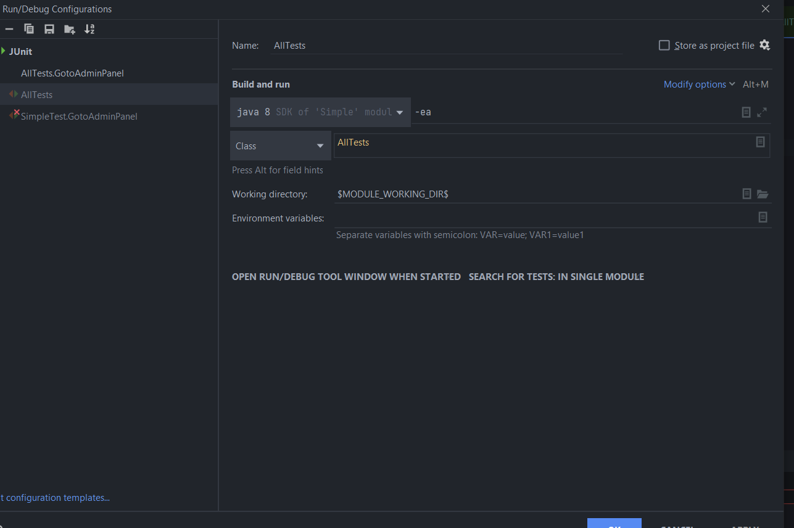
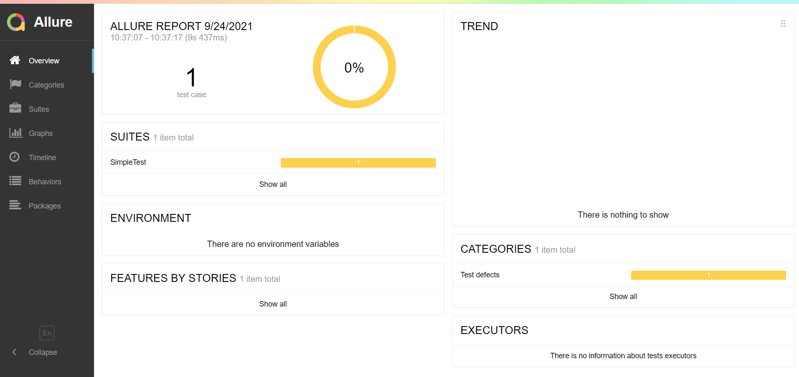
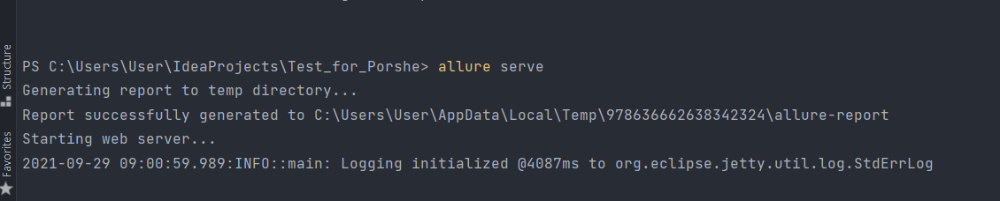

UI фреймворк на основе selenide. 
Отчет в виде Allure.
Для запуска нужно:
JDK 1.8.*
maven 3.6.3
allureСomandLine

Запуск всех тестов: mvn clean test

Получение отчета: mvn allure:serve
Или "allure report" -allureComandLine

остановить чтение "CTRL+C"